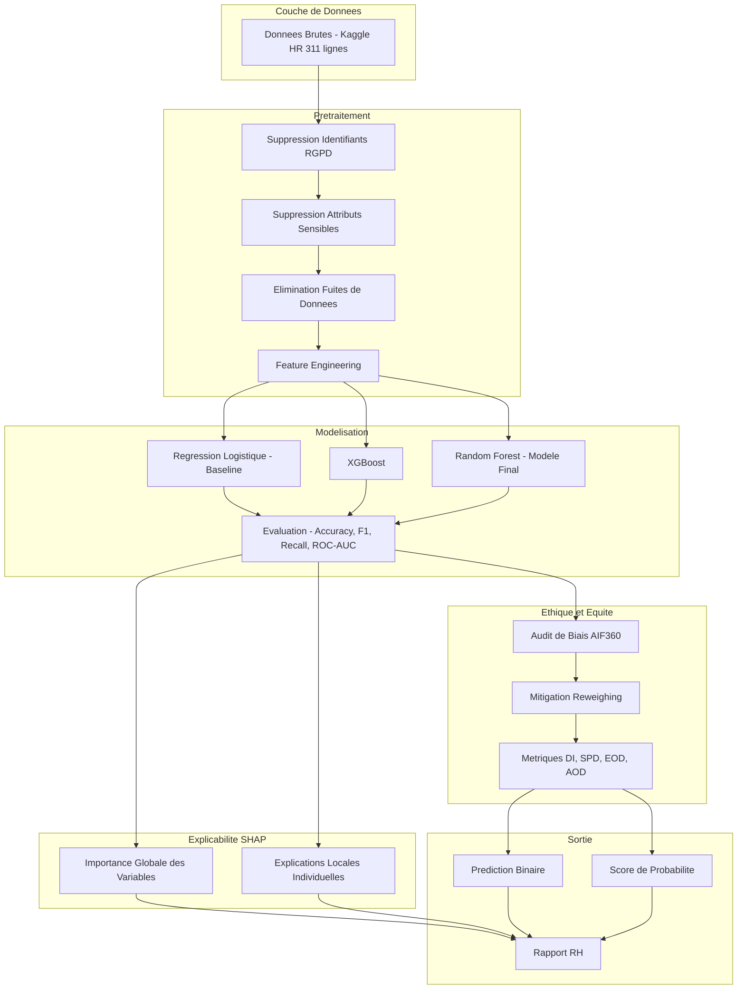

# Architecture du projet

```mermaid
graph TD
    subgraph Data_Layer [Couche de Donnees]
        A[Donnees Brutes - Kaggle HR 311 lignes]
    end
    subgraph Preprocessing [Pretraitement]
        B[Suppression Identifiants RGPD]
        C[Suppression Attributs Sensibles]
        D[Elimination Fuites de Donnees]
        E[Feature Engineering]
        A --> B --> C --> D --> E
    end
    subgraph Modeling [Modelisation]
        I[Regression Logistique - Baseline]
        K[XGBoost]
        L[Random Forest - Modele Final]
        M[Evaluation - Accuracy, F1, Recall, ROC-AUC]
        E --> I
        E --> K
        E --> L
        I --> M
        K --> M
        L --> M
    end
    subgraph Explainability [Explicabilite SHAP]
        N[Importance Globale des Variables]
        O[Explications Locales Individuelles]
        M --> N
        M --> O
    end
    subgraph Fairness_Ethics [Ethique et Equite]
        F[Audit de Biais AIF360]
        G[Mitigation Reweighing]
        H[Metriques DI, SPD, EOD, AOD]
        M --> F --> G --> H
    end
    subgraph Output [Sortie]
        Q[Prediction Binaire]
        R[Score de Probabilite]
        S[Rapport RH]
        H --> Q
        H --> R
        N --> S
        O --> S
        Q --> S
        R --> S
    end
```
